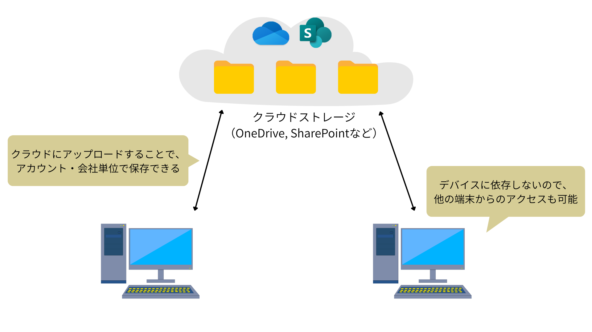
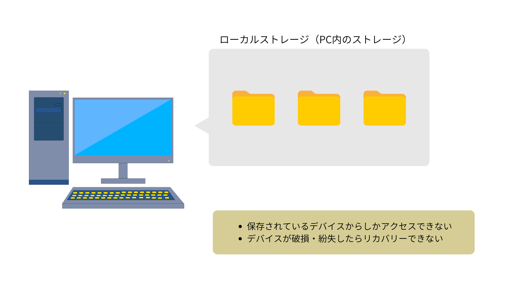

# クラウドストレージ

**インターネット上にある、「会社・個人のデータ保管庫」** にファイルを保存・共有する仕組みです。

作成した成果物（Word文書、PDFファイル等）は、ローカルフォルダではなく、**クラウドストレージ**に保存することで、様々なメリットを受けることができます。

## ローカルフォルダとの比較

クラウドストレージの対義語として、**ローカルフォルダ**があります。

ローカルフォルダは、自分のパソコンの中にある、Cドライブなどの保存場所のことです。

ローカルフォルダとクラウドストレージを比較すると、次のような特徴があります。

| 比較ポイント | ローカルフォルダ | クラウドストレージ |
|---|---|---|
| 保存場所 | 自分のパソコンの中 | インターネット上（会社やサービス提供元のサーバー） |
| インターネット接続 | 不要 | 基本的に必要 |
| 利用できる端末 | 保存したそのPCのみ | 複数端末（会社PC・自宅PCなど） |
| 他の人との共有 | メール添付・USBなどが必要 | 共有設定で簡単に可能 |
| 同時編集 | できない | できる（ファイル形式による） |
| 最新版の管理 | 各自で管理が必要 | 常に最新の1ファイルを共有 |
| PC故障時の安全性 | データ消失の可能性あり | データは残る |
| 主な利用イメージ | 個人作業向け | チーム・会社全体での作業向け |

クラウドストレージに保存しておくことで、PC端末が急に使えなくなっても、他の端末でアクセスすることができます。

**日ごろから、ローカルフォルダではなく、クラウドストレージに保存するようにしましょう。**

## Microsoftが提供しているクラウドストレージサービス

主に利用するサービスは、「**OneDrive for Business**」と「**SharePoint**」です。

### OneDrive for Business
**個人用ファイル**を保存するサービスです。

保存されているファイルは、基本的にほかの人は閲覧できません
> [!NOTE]  
> アクセス設定自体は存在します。  
> ファイルを共有したいときは、都度設定する必要があります。

### SharePoint
社内の**共有ファイル**を保存するサービスです。

保存されているファイルは、同じチームのメンバーが閲覧・編集できます。
> [!NOTE]  
> アクセス設定は、ファイルごとに調整可能です。

---
[概要](./README.md) ⬅️ | [🏠](./README.md) | ➡️ [OneDrive for Business](./01-OneDrive.md)