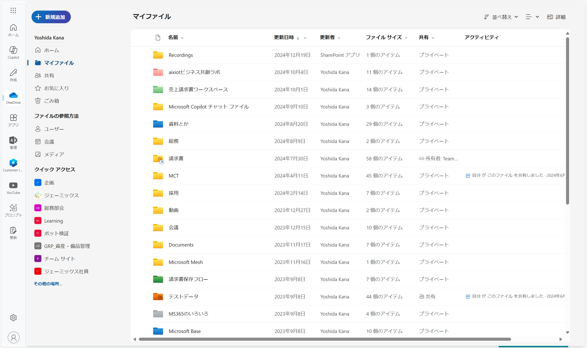
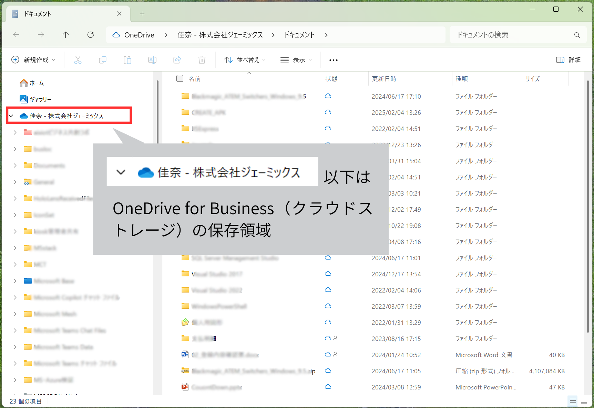
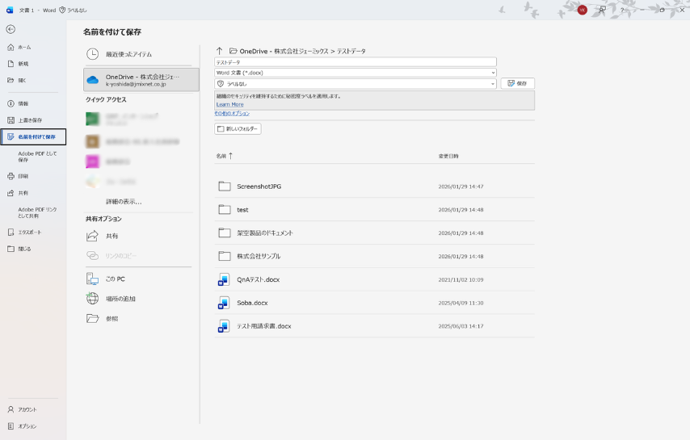
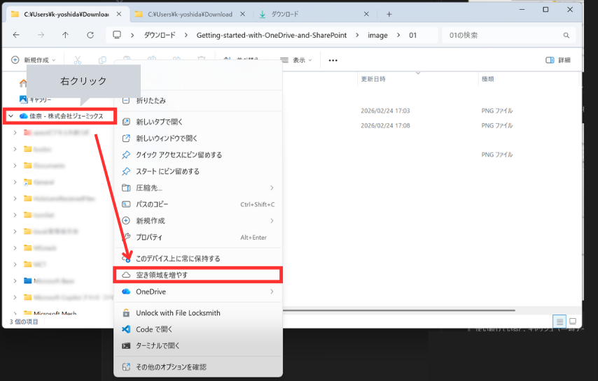
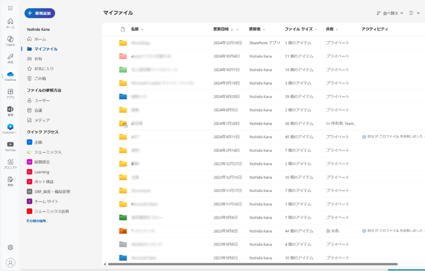

# OneDrive for Business

**個人用の**ファイルを管理するサービスです。

ここに保存されているファイルは、基本的には他の人は閲覧できません。

自分で作成したファイルや、取っておきたい資料は、基本的にここに保存します。

> [!NOTE]  
> Windows PCには既定としてOneDriveアプリが入っていることが多いですが、こちらは個人利用者向けのものとなっています。  
> 組織のアカウント（会社メールアドレス）と紐づいたOneDriveは「**OneDrive for Business**」という名称になり、セキュリティ・コンプライアンス機能が強化されたバージョンとなっています。  
> どちらも基本的な使い方は変わりません。

## アクセス方法
アクセス方法は複数あります。

### ファイル エクスプローラーからアクセスする（推奨）
ローカルフォルダと同じ感覚で使えるため、おすすめです。

エクスプローラーを立ち上げると、左のフォルダ一覧に「(氏名) - 株式会社ジェーミックス」と表示されています。

ここから、ローカルフォルダと同じようにファイルの管理ができます。

文書の保存場所も、ローカルフォルダと同様に選択することができます。

> [!CAUTION]  
> 使い続けていると、キャッシュ（一時データ）が溜まってしまい、ストレージを圧迫することがあります。
> OneDriveフォルダを右クリックし、「空き容量を増やす」から、キャッシュを削除できます。
> 定期的に削除するのがおすすめです。
> 

### ブラウザからアクセスする
[https://jmixnetcojp-my.sharepoint.com/](https://jmixnetcojp-my.sharepoint.com/)から、ブラウザ版にアクセスできます。

ブラウザ版では、共有されたファイルやSharePointのファイルも確認することができます。

Officeドキュメント（.docx, .xlsx, .pptx等）はブラウザ上でも編集ができますが、PDFやテキストファイルは閲覧のみ（編集不可）となっています。

編集するには、エクスプローラー版からファイルを開くか、  
一度ダウンロードして編集し、再度アップロード（上書き）する必要があります。

---
[クラウドストレージ](./00-CloudStorage.md) ⬅️ | [🏠](./README.md) | ➡️ [SharePoint](./02-SharePoint.md)