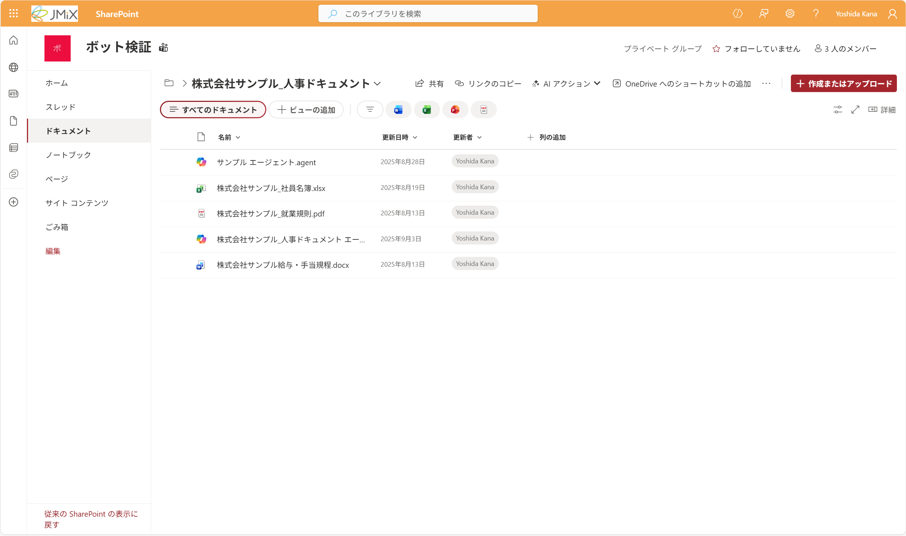
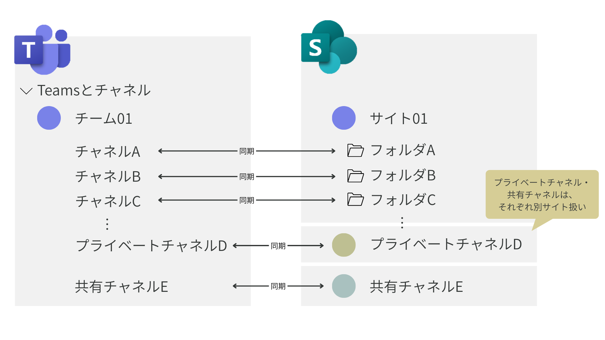
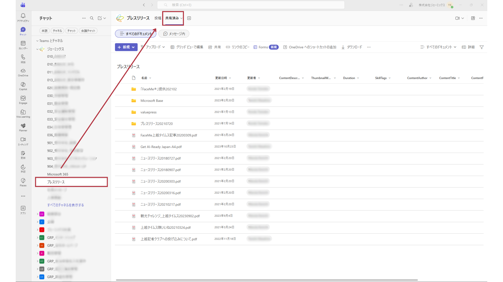
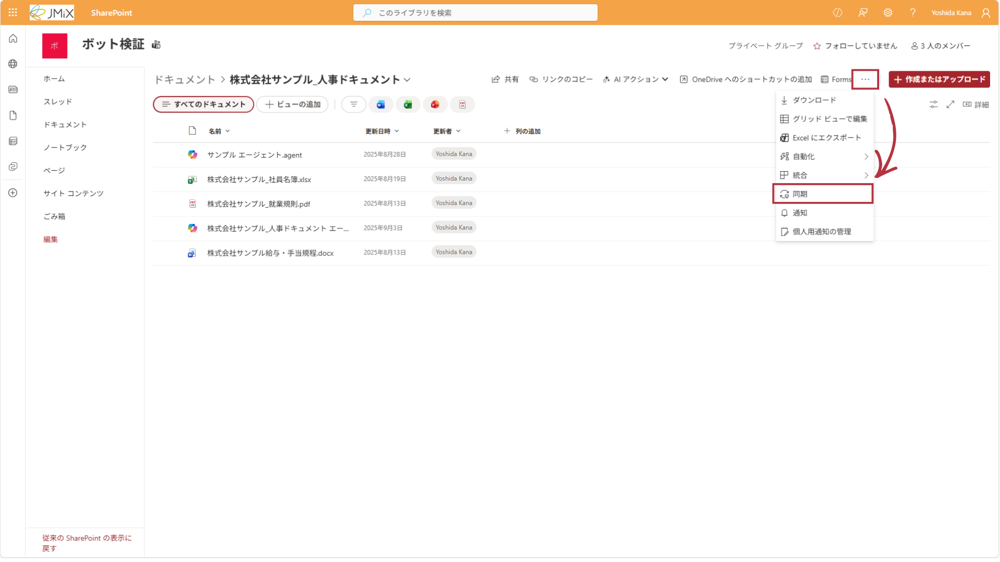
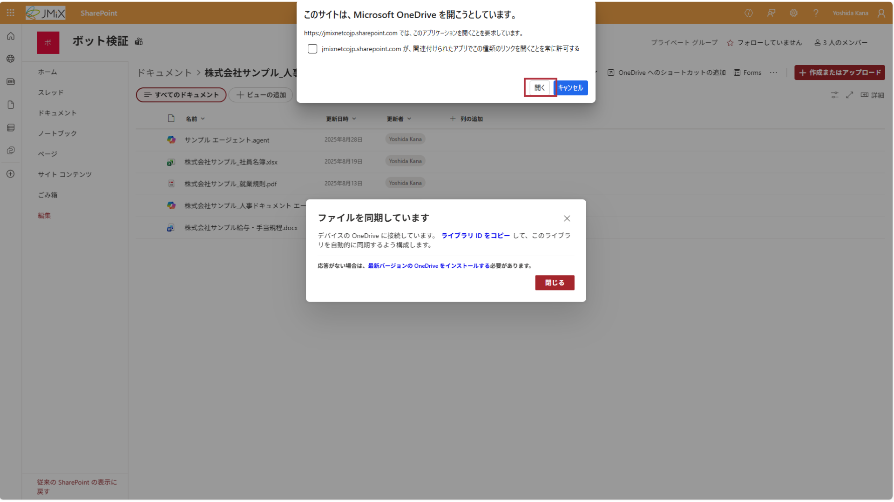
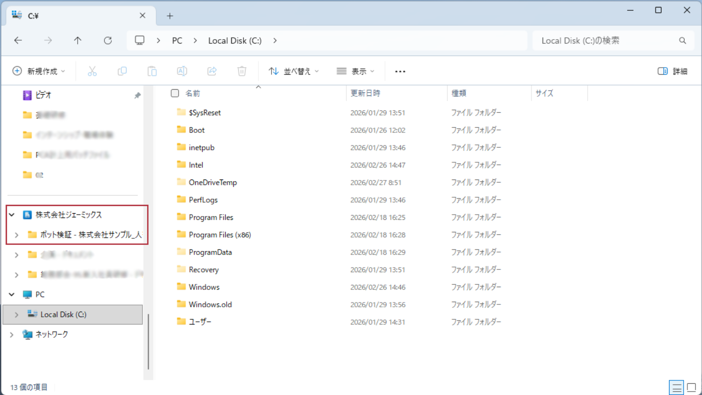

# SharePoint

**社内の**ファイル共有・情報共有をするサービスです。

SharePointの機能の一つとして、共有ファイルの管理をすることができます。

ここに保存されているファイルは、基本的に**チームメンバー全員が**閲覧・編集できます。

> [!NOTE]  
> ここでは、SharePointのファイル共有機能のみ紹介します。  
> SharePointリストは[Getting-Start-with-Lists](https://github.com/k-yoshida00/Getting-started-with-Lists)を参照してください。  
> SharePointサイト等、その他の機能の紹介は割愛しますが、興味のある方は適宜調べてみてください。（あまり使っていないのが現状です）

## Teamsとの関係
SharePointは**サイト**というグループ単位で、ファイルや情報の共有を行います。

共有された情報は、サイトのメンバーのみアクセスできます。

SharePointサイトはTeamsのチームと連携しており、ファイル・アクセス権限が同期されます。

Teamsチャネルに投稿したファイルは、自動的に同期先のSharePointフォルダにアップロードされます。

また、フォルダを手動で作成することもできます。手動で作成したフォルダもTeamsと同期しますが、チャネルが自動作成されることはありません。

## SharePointにアクセスする
アクセスの方法は3種類あります。
### Teamsからアクセスする

1. 同期されているTeamsのチャネルを開く
2. 「共有済み」タブをクリック
3. 保存されているドキュメントを閲覧できます

### ブラウザからアクセスする

[https://jmixnetcojp.sharepoint.com/_layouts/15/sharepoint.aspx](https://jmixnetcojp.sharepoint.com/_layouts/15/sharepoint.aspx) から、ブラウザ版にアクセスできます。

### エクスプローラーからアクセスする
初期設定が必要ですが、OneDrive for Businessと同じように、ファイル エクスプローラーからアクセスすることもできます。

設定は、SharePointサイト/フォルダ単位で行います。

#### 初期設定方法

1. ブラウザかTeamsから、アクセスしたいサイト/フォルダにアクセス
2. 「同期」をクリック

3. ファイル エクスプローラーを開くと、同期したフォルダが表示されます

---
[OneDrive for Business](./01-OneDrive.md) ⬅️ | [🏠](./README.md) | ➡️ [ファイル共有](./03-FileSharing.md)