# クラウドファイル利用のポイント
OneDrive・SharePointに保存されているファイルは、簡単・安全に共有する機能や、、同時に編集する機能など、**共同作業に特化した**機能が多く搭載されています。

これらの機能を使いこなすことで、安全に・効率よく作業を進めることができます。

## ファイルの共有
ファイルはクラウドを経由して共有することで、常に最新のデータを共有することができます。

### 共有方法① リンクの発行　【社内共有向け】
1. 共有したいファイルの「共有」をクリック
> [!NOTE] 
> 「共有」はさまざまなところにボタンとして配置されています。どこからアクセスしても、ほぼ同じ動作になります。
> 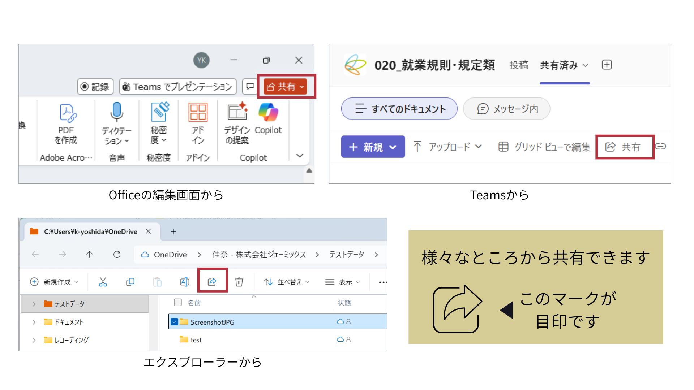

2. 歯車のアイコンをクリック  
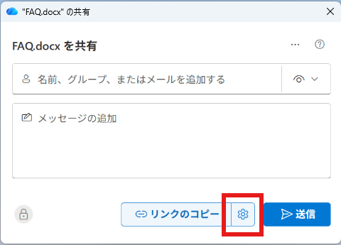

3. アクセス権限を設定
> [!NOTE]  
> アクセス権限を設定することで、誰に公開するか、どこまで（表示のみ/編集可能/DL禁止等）公開するか、いつまで公開するか等が設定できます。  
> 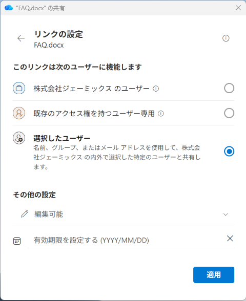

4. 「適用」をクリック

5. 「リンクのコピー」をクリックし、共有リンクをクリップボードに保存  
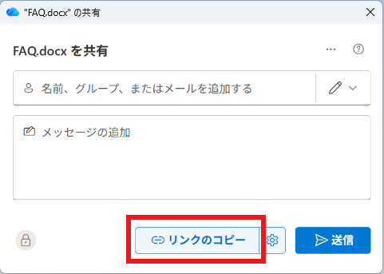

6. チャットやメールなど、共有したい場所に適宜貼り付けて共有  
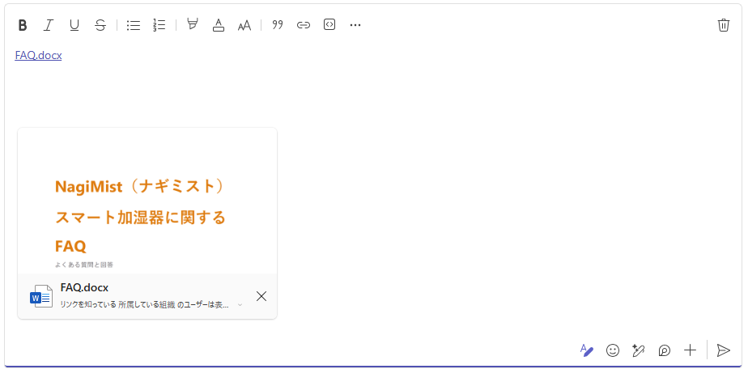

### 共有方法② メール送信　【社外共有向け】
1. 共有したいファイルの「共有」をクリック
> [!NOTE] 
> 「共有」はさまざまなところにボタンとして配置されています。どこからアクセスしても、ほぼ同じ動作になります。
> 

2. 共有したい相手を入力 
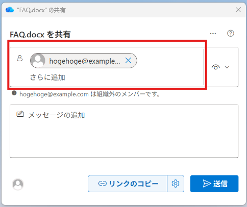
> [!NOTE]  
> メールアドレスを入力することで、社外の相手にもファイル共有ができます。

3. アクセス権限を設定
> [!NOTE]  
> アクセス権限を設定することで、誰に公開するか、どこまで（表示のみ/編集可能/DL禁止等）公開するか等が設定できます。  
> 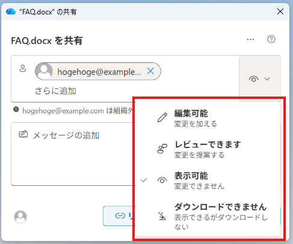

4. 【任意】「メッセージ」を設定 
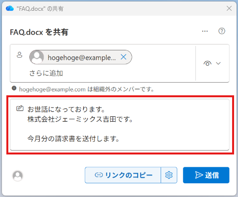

5. 「送信」をクリックして共有  
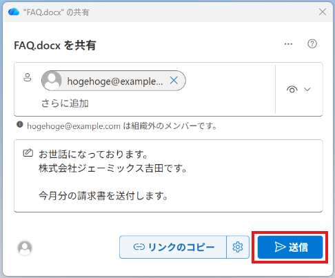

6. 共有相手にメールが届きます。

社外かつMicrosoftアカウント以外の共有相手には、ワンタイムパスワードを用いた認証を行ったうえで共有されます。
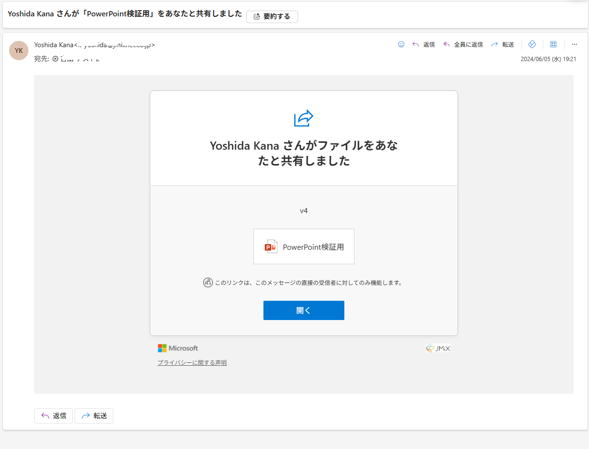

### 共有のポイント
リンク共有後に情報を書き換えた場合でも、共有相手は**常に最新のデータ**が閲覧できます。

また、アクセス権限も付与後に変更することが可能です。

誤って別の人に共有した場合でも、アクセス権限を削除することで、不正アクセスを防ぐことができます。

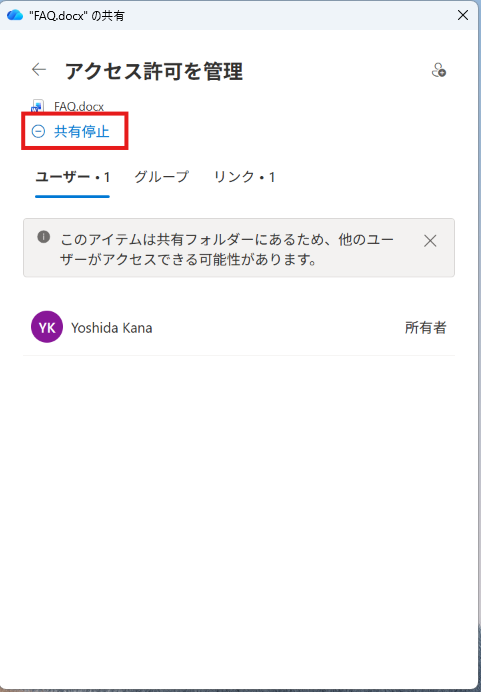

---
## バージョン管理
クラウドストレージに保存されているOfficeドキュメントは、ファイルの編集履歴を戻すことができます。

### バージョンの戻し方
1. ファイルを開く
2. ファイル名をクリック
3. 「バージョン履歴」をクリック

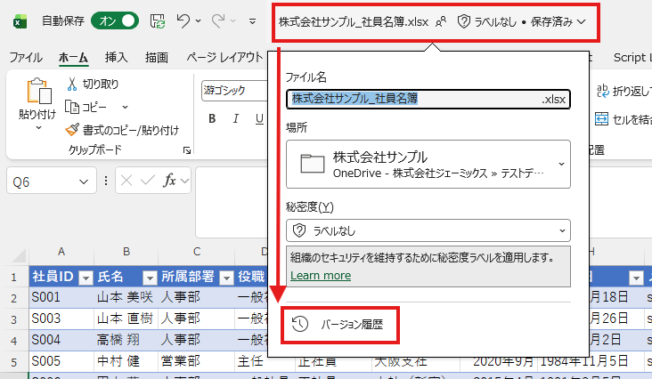

4. 戻したいバージョンを選択

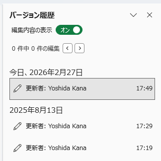

5. 内容を確認し、「復元」をクリック

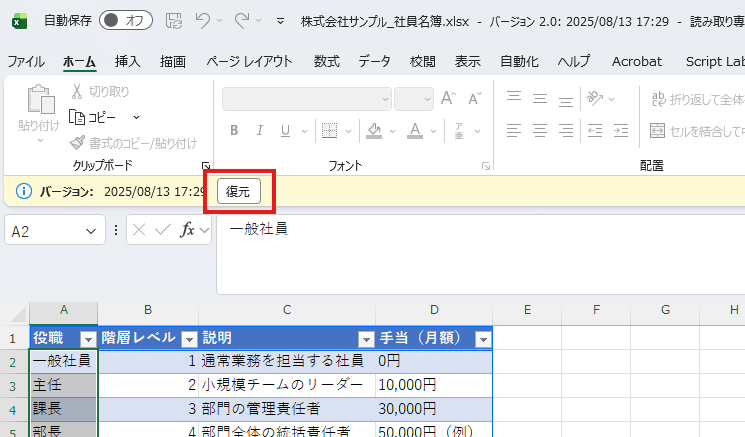

6. 指定のバージョンに戻ります

## 「ファイル共有」と「バージョン管理」を使いこなそう
ファイルを修正するたびに、新規ファイルとしてアップロードすると、データ容量の圧迫につながります。

また、どのファイルが最新なのかがわかりづらくなることもあります。

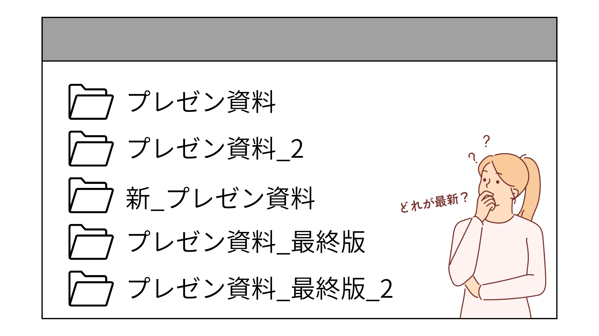

- **誰かに共有するときは、アップロードではなくリンクで共有する**
- **むやみに複製でバックアップせず、バージョン管理を使う**

この2点を守って、管理するファイルを一本化しておきましょう。

---

## 演習
複数人で、実際にファイル共有と共同編集をしてみましょう！

### 演習手順
1. Excelを開き、セルに適当な数字と自分の名前を入力する

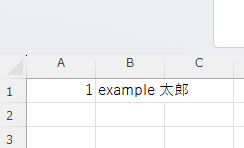

2. 「共有テスト_自分の名前.xlsx」という名前で、**自分のOneDrive**に保存する

3. **表示のみ（編集不可）**のアクセス権限で共有リンクを作成し、ペアにリンクを渡す

4. **自分で作成したExcelファイルは開いたまま**、ペアからもらったリンクを開き、次の状態を確認する
- 画面右上に、ペアのアイコンが表示されている（現在、同じファイルを開いている人が表示されます）
- ペアのExcelに、自分は入力できない（「表示のみ」のアクセス権限では、編集できません）

5. ペアのExcelをいったん閉じる
6. 自分のExcelの共有を開き、**編集可**のアクセス権限で再度共有リンクを作成し、ペアにリンクを渡す
7. ペアからもらったリンクを開き、編集ができることを確認する
8. ペアのExcelをいったん閉じる
9. 自分のExcelの共有を開き、作成した共有リンクをすべて削除する
10. ペアから今までにもらった共有リンクを開き、アクセスできないことを確認する
---
[SharePoint](./02-SharePoint.md) ⬅️ | [🏠](./README.md) 