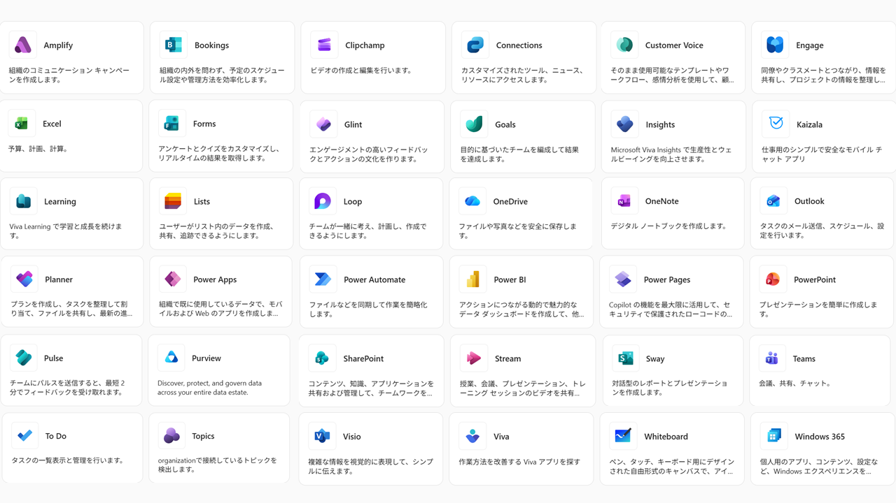

# Template-Getting-started-with-FileSharing
OneDrive for BusinessとSharePointを始めるための、チュートリアルです。ファイル共有の基本的な使い方を学びます。

# 目次
* [概要](./README.md)
* [クラウドストレージ](./00-CloudStorage.md)
* [OneDrive for Business](./01-OneDrive.md)
* [SharePoint](./02-SharePoint.md)
* [ファイル共有](./03-FileSharing.md)

# Microsoft 365とは

Microsoft 365（マイクロソフト サンロクゴ）は、Office 365をはじめとしたMicrosoftの様々なアプリを、サブスクリプション契約で利用できるサービスです。

# ファイル共有
Word, Excel, PowerPointなどのアプリを、クラウド（インターネット）に接続して利用することで、常に最新のバージョンでアプリを利用できたり、社内の人と簡単にファイル共有を行うことができます。

# ファイル共有のチュートリアル
次のページから、実際のファイル共有の使い方を学びます。

---
 [🏠](./README.md) | ➡️ [クラウドストレージ](./00-CloudStorage.md)
